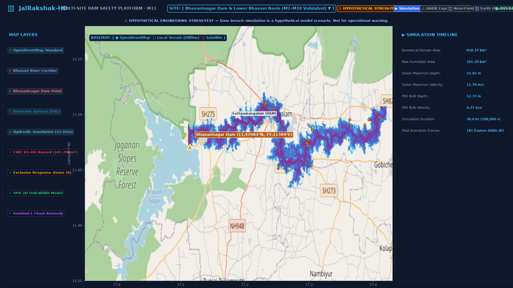
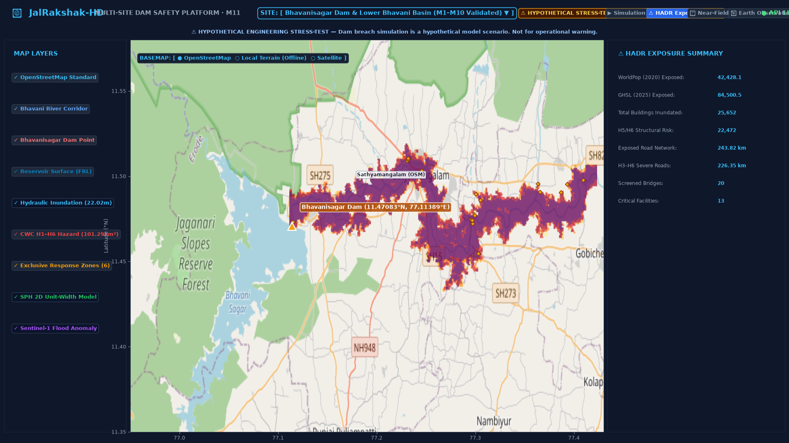
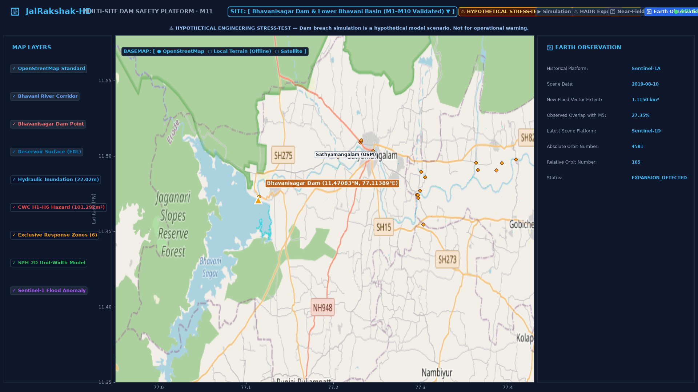
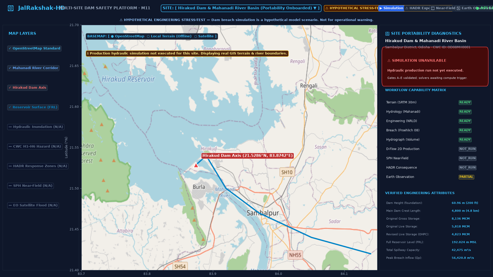
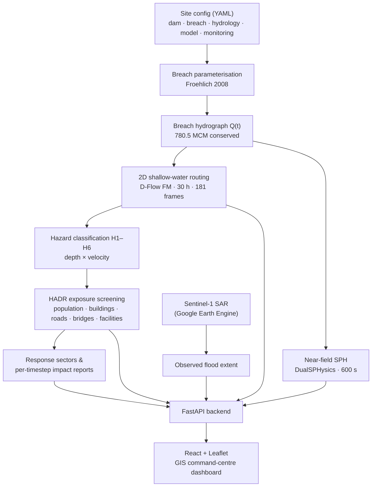

<div align="center">

# 🌊 JalRakshak-HD

### Hydrodynamic Dam-Break & HADR Intelligence Platform

**Smart India Hackathon 2026 · Problem Statement SIH26161**
*Dam Break Inundation Modelling Using Hydrodynamic Modelling of any River*


</div>

> ⚠️ **Research screening prototype.** The breach scenario is hypothetical. All hydraulic results are model outputs for emergency-preparedness screening and are **not** an official warning or a statutory Emergency Action Plan.

---

## 📑 Table of Contents

1. [Overview](#1--overview)
2. [Key Features](#2--key-features)
3. [Demo](#3--demo)
4. [How It Works](#4--how-it-works)
5. [System Architecture](#5--system-architecture)
6. [Headline Results (Bhavanisagar Dam)](#6--headline-results-bhavanisagar-dam)
7. [Fail-Honest Verification](#7--fail-honest-verification)
8. [Technology Stack](#8--technology-stack)
9. [Project Structure](#9--project-structure)
10. [Getting Started](#10--getting-started)
11. [API Reference](#11--api-reference)
12. [Multi-Site Onboarding](#12--multi-site-onboarding)
13. [Testing & Validation](#13--testing--validation)
14. [Data Sources](#14--data-sources)
15. [Limitations](#15--limitations)
16. [Roadmap](#16--roadmap)
17. [Contributors](#17--contributors)

---

## 1. 🎯 Overview

Dam failures release large reservoir volumes in hours and can devastate downstream communities and infrastructure. Dam-break planning in practice often suffers from four gaps:

| Gap | What goes wrong |
| :-- | :-- |
| **Coarse inundation maps** | 1D profiles miss 2D floodplain behaviour, lateral velocity and flood-front timing. |
| **Disconnected consequence data** | Hydraulics are rarely joined to population, buildings, roads, bridges and critical facilities. |
| **Near-field blind spots** | Shallow-water models cannot resolve violent splash, jets and impact close to the dam. |
| **Single-dam workflows** | Hard-coded pipelines can't be reused on another river without a rewrite. |

**JalRakshak-HD** closes these gaps with a **configuration-driven** pipeline that goes from dam geometry to a breach hydrograph, a 2D flood simulation, a near-field particle simulation, hazard classification, humanitarian exposure screening and an interactive GIS command-centre dashboard. A new dam is onboarded by writing YAML, not by changing code.

The prototype is fully worked on **Bhavanisagar Dam (Bhavani River, Tamil Nadu)** and tested for portability on **Hirakud Dam (Mahanadi River, Odisha)**.

---

## 2. ⚡ Key Features

- **Parametric breach modelling:** breach width, formation time and peak discharge from Froehlich (2008) regressions, with MacDonald & Langridge-Monopolis and CWC-style options configurable per site.
- **Mass-conserving hydrograph synthesis:** breach outflow Q(t) that conserves the 780.50 MCM reservoir volume.
- **2D flood routing (D-Flow FM):** 30-hour simulation on an 818.37 km² domain, exported as 181 frames at 600 s steps (depth, velocity, arrival time).
- **Near-field SPH (DualSPHysics):** Lagrangian particle model of the first 1.5 km below the breach for the first 600 s.
- **Hazard classification H1–H6:** combined depth-velocity classes from the CWC / AIDR Guideline 7-3 thresholds.
- **HADR consequence screening:** population (two independent datasets), buildings, roads, bridges, critical facilities and 6 non-overlapping response sectors.
- **Earth observation pipeline:** Sentinel-1 SAR flood-extent detection (Google Earth Engine), demonstrated on the August 2019 Bhavani flood event.
- **Interactive GIS dashboard:** playback scrubber, click-anywhere point inspector, layer controls, per-timestep impact reports and a site switcher.
- **Offline-capable demo:** pre-built overlays, GeoJSON caches and a local SRTM hillshade, so the dashboard runs with no internet or credentials.
- **Fail-honest design:** anything not actually computed for a site is shown as `NOT_RUN` instead of being filled in.

---

## 3. 🎬 Demo

| Simulation playback | HADR exposure |
| :-: | :-: |
|  |  |

| Earth observation (Sentinel-1) | Hirakud portability |
| :-: | :-: |
|  |  |

▶️ **70-second walkthrough video:** [`outputs/final_demo/JalRakshak_HD_SIH_70sec_Demo.mp4`](outputs/final_demo/JalRakshak_HD_SIH_70sec_Demo.mp4)
📜 **Presenter script and jury Q&A:** [`docs/SIH_DEMO_SCRIPT.md`](docs/SIH_DEMO_SCRIPT.md) · [`docs/SIH_JURY_QA.md`](docs/SIH_JURY_QA.md)

---

## 4. 🧭 How It Works



**Scale separation.** The 2D model handles far-field propagation over about 52 km of river and 30 hours. The SPH model handles only the near-dam region and the first 10 minutes, where depth-averaged assumptions break down. These two solvers are **decoupled** in this prototype (see [Limitations](#15--limitations)).

---

## 5. 🏗️ System Architecture

```
┌──────────────────────────────────────────────────────────────────────────┐
│                           JALRAKSHAK-HD PLATFORM                         │
├──────────────────────────────────────────────────────────────────────────┤
│ DATA LAYER                                                               │
│  SRTM 30 m DEM · HydroSHEDS · CWC NRLD 2023 · OSM · Google Open          │
│  Buildings · WorldPop · GHSL · ESA WorldCover · Sentinel-1 SAR           │
├──────────────────────────────────────────────────────────────────────────┤
│ COMPUTE / SCREENING ENGINE (offline pipeline, scripts/)                  │
│  Breach + hydrograph · D-Flow FM 2D · DualSPHysics · hazard classifier   │
│  HADR exposure · Sentinel-1 flood detection · audit & validation gates   │
├──────────────────────────────────────────────────────────────────────────┤
│ BACKEND  FastAPI (backend/app)                                           │
│  /api/sites · /api/simulation · /api/gis · /api/hadr · /api/sph          │
│  /api/remote-sensing · /api/reports · /api/provenance                    │
├──────────────────────────────────────────────────────────────────────────┤
│ FRONTEND  React 19 + TypeScript + Vite + Leaflet                         │
│  Modes: Simulation · HADR Exposure · Near-Field SPH · Earth Observation  │
└──────────────────────────────────────────────────────────────────────────┘
```

### What is live vs. pre-computed

| Aspect | In this prototype | Production target |
| :-- | :-- | :-- |
| **Solver execution** | Solvers run offline; the backend serves their verified outputs (181 PNG frames, GeoPackages, rasters) | On-demand solver runs on an HPC queue |
| **Solver coupling** | Decoupled; both driven from the same breach geometry | Boundary-flux coupled 3D/2D workflow |
| **Database** | File-based manifests; PostGIS is optional | PostgreSQL / PostGIS with live telemetry |
| **Satellite data** | Pre-processed Sentinel-1 scenes plus Earth Engine scripts | Automated live ingestion |
| **Sites** | Bhavanisagar fully simulated; Hirakud configured, not simulated | National dam-registry scale |

---

## 6. 📊 Headline Results (Bhavanisagar Dam)

Scenario **`BHV_BASE`**: hypothetical overtopping breach at full reservoir level. Values below are the locked figures from `outputs/validation/M12_FINAL_FREEZE.json`.

### Breach & hydrograph

| Parameter | Value | Basis |
| :-- | --: | :-- |
| Water volume above breach invert (Vw) | 780.50 MCM | CWC NRLD 2023 / TN WRD |
| Average breach width (B_avg) | 219.28 m | Froehlich (2008) |
| Breach formation time (t_f) | 14,095.59 s (≈ 3.92 h) | Froehlich (2008) |
| Peak breach discharge (Q_peak) | 18,742.38 m³/s | Parametric hydrograph |
| Hydrograph volume | 780.50 MCM | Mass-balance checked |

### 2D hydrodynamics (D-Flow FM)

| Parameter | Value |
| :-- | --: |
| Computational domain | 818.37 km² (82,309 cells, uniform 100 m grid) |
| Simulation length / output | 108,000 s (30 h) · 181 frames at 600 s |
| Maximum inundated area | 101.29 km² (wet where depth > 0.05 m) |
| Maximum depth / P95 depth | 22.02 m / 12.72 m |
| Maximum velocity / P95 velocity | 11.79 m/s / 4.27 m/s |
| Mass-balance residual | 0.041 MCM (0.0052 %) |
| Severe hazard area (H3–H6) | 97.99 km² (96.74 % of inundated area) |
| Extreme hazard area (H5–H6) | 87.29 km² |
| Bed roughness | Uniform Manning n = 0.035 |

### Near-field SPH (DualSPHysics v5.4)

| Parameter | Value |
| :-- | --: |
| Model type | 2D unit-width longitudinal section (not full 3D) |
| Particles | 10,982 (6,800 fluid + 4,182 boundary), spacing 1.0 m |
| Duration / reach | 600 s / first 1.5 km below breach |
| Max depth / max velocity | 17.11 m / 34.78 m/s |
| Front position at 600 s | 1,280.41 m |

### HADR consequence screening

| Metric | Value |
| :-- | --: |
| Exposed population, WorldPop 2020 | 42,428 (40,744 in H3–H6) |
| Exposed population, GHSL 2023 | 84,501 (81,768 in H3–H6) |
| Exposed buildings | 25,652 (22,472 in H5–H6) |
| Inundated road length | 243.82 km (226.35 km in H3–H6) |
| Bridges screened / critical facilities | 20 / 13 |
| Response sectors | 6 non-overlapping chainage sectors, from the dam toe to the Lower Bhavani canal confluence |

> **Reading the population numbers:** the two datasets differ by about 2×. This is reported as a dataset spread rather than hidden. No casualty or loss-of-life model is implemented; the output is *exposure only*.

### Earth observation (Sentinel-1)

| Metric | Value |
| :-- | --: |
| Benchmark event | August 2019 Bhavani flood (scene of 2019-08-10) |
| Detected new flood extent | 1.19 km² |
| Method | VV/VH backscatter change detection with slope masking |

This benchmarks the SAR pipeline against a real, documented *natural* flood. It does **not** validate the dam-break simulation, since no dam failure has occurred at Bhavanisagar.

### Cross-solver comparison

D-Flow FM and DualSPHysics agree on the downstream trend of the flood front but **diverge on velocity** (the SPH model shows strong attenuation after the near-dam jet, while the depth-averaged 2D velocity grows downstream). The two models use non-equivalent formulations and forcing, so this spread is reported as a cross-model difference, not as a validation error. Direct coupling is marked `DESIGN_ONLY` / `NOT_READY`, and 500 m is the recommended future handoff chainage.

### Hirakud Dam (generalization site)

| Item | Value |
| :-- | :-- |
| Location | Mahanadi River, Odisha (EPSG:32644) |
| NRLD live storage | 5,818 MCM |
| Screening peak discharge | 65,163.63 m³/s |
| Solver status | `INPUT_READY_NOT_EXECUTED` (inputs prepared; no 2D/3D run performed) |

---

## 7. 🛡️ Fail-Honest Verification

Every result carries an explicit status, and the code and docs are audited so a claim is not stated more strongly than its evidence.

| Tier | Meaning | Example |
| :-- | :-- | :-- |
| 🟢 **VERIFIED / AUTHORITATIVE** | Computed and checked, or taken from an official source | Mass conservation (0.0052 % residual); NRLD storage |
| 🟡 **MODEL_DERIVED / ASSUMPTION** | Empirical or parametric estimate with documented uncertainty | Froehlich breach geometry (±25–35 %); uniform Manning n |
| 🟠 **PARTIAL / INPUT_READY** | Inputs built but solver not run | Hirakud second site |
| 🔴 **NOT_RUN / BLOCKED** | Not executed; shown as such in the UI and API | Any module without outputs for the selected site |

Supporting checks in `scripts/`: `audit_final_claims.py`, `audit_no_fake_results.py`, `audit_hardcoding.py`, `validate_final_scientific_values.py` and `validate_m12_final.py`. The point query returns `Outside model extent` rather than a zero when you click outside the domain.

---

## 8. 🛠️ Technology Stack

| Layer | Technologies |
| :-- | :-- |
| **Frontend** | React 19, TypeScript, Vite 8, Leaflet / React-Leaflet, Recharts, Tailwind CSS v4, Lucide icons |
| **Backend** | FastAPI, Uvicorn, Pydantic v2, pydantic-settings, PyYAML, python-dotenv |
| **Geospatial & science** | GeoPandas, Shapely, PyProj, Rasterio, NumPy, SciPy, Pandas, Xarray, netCDF4, h5py, Matplotlib |
| **Earth observation** | Google Earth Engine API (`earthengine-api`), Sentinel-1 GRD |
| **Database (optional)** | PostgreSQL / PostGIS via `psycopg` and SQLAlchemy |
| **Solvers** | Deltares D-Flow FM (Delft3D FM Suite 2026.02), DualSPHysics v5.4 |
| **Hazard standard** | CWC / AIDR Guideline 7-3 (Smith, Davey & Cox, 2014) |

---

## 9. 📁 Project Structure

```
JalRakshak---HD/
├── README.md
├── VERSION                       # v1.0-SIH
├── requirements.txt              # Python dependencies
├── .env.example                  # Optional PostGIS / Earth Engine settings
├── START_DEMO.bat                # Windows one-click launcher
├── start_jalrakshak.ps1          # Port check + backend + frontend startup
│
├── backend/
│   ├── app/
│   │   ├── main.py               # FastAPI entrypoint, routers, static mounts
│   │   ├── api/                  # gis, hadr, health, project, provenance,
│   │   │                         #   remote_sensing, reports, simulation, sites, sph
│   │   ├── core/                 # config, CRS, units, logging, site path resolver
│   │   ├── models/               # breach, dam, hydrograph, HADR, remote-sensing models
│   │   ├── schemas/              # Pydantic request/response schemas
│   │   └── services/             # breach & peak-discharge models, hydrograph,
│   │                             #   hazard classification, site registry/validator,
│   │                             #   workflow gates, GEE flood monitor
│   └── tests/                    # 9 pytest modules (57 test functions)
│
├── frontend/                     # React 19 + Vite + Leaflet dashboard
│   └── src/components/           # MapView, SimulationPanel, HADRPanel, SPHPanel,
│                                 #   EOPanel, ImpactReportTab, LayerPanel,
│                                 #   SiteCapabilityPanel, Header
│
├── sites/                        # One folder per dam (declarative onboarding)
│   ├── bhavanisagar/             # site · dam · breach · hydrology · model · monitoring
│   └── hirakud/                  #   + source_manifest.json
│
├── configs/                      # Global YAML: breach models, hydrograph, HADR,
│                                 #   GEE monitoring, hybrid solver, paths, sites registry
│
├── data/                         # Rasters, GeoPackages, solver inputs
│   ├── raw/                      # Unmodified provider data
│   ├── hydrology/ · hadr/ · gee/ # Derived layers
│   ├── dflowfm/                  # D-Flow FM model, boundaries, hydrographs
│   ├── sph/                      # DualSPHysics case, gauges, output frames
│   └── hirakud/                  # Second-site inputs
│
├── outputs/
│   ├── dashboard/                # 181 simulation frames, overlays, GeoJSON, screenshots
│   ├── hadr/ · gee/ · comparison/# Exposure tables, SAR results, solver comparison
│   ├── maps/ · reports/          # Figures and milestone reports (M3–M12)
│   ├── validation/               # Audit manifests and the M12 freeze record
│   └── final_demo/               # Demo video and clips
│
├── scripts/                      # Acquisition, modelling, validation, audit, CLI
├── docs/                         # Architecture, lineage, provenance, demo script, jury Q&A
├── demo_package/                 # Lightweight copy of docs, reports and site configs
└── solver_tests/dflowfm_f34/     # Deltares F34 benchmark case
```

---

## 10. 🚀 Getting Started

### Prerequisites

| Tool | Version |
| :-- | :-- |
| Python | 3.10 – 3.12 (3.12.3 used for the release) |
| Node.js | 18+ (20+ recommended) |
| Git | 2.30+ |
| OS | Windows 10/11 for the launcher scripts; Linux/macOS work with the manual steps |

> The dashboard serves **pre-computed** results, so **D-Flow FM, DualSPHysics, PostGIS and Earth Engine credentials are not needed** to run the demo.

### 1. Clone

```bash
git clone https://github.com/vishalgokul504/JalRakshak---HD.git
cd JalRakshak---HD
```

### 2. Backend

```bash
python -m venv .venv
# Windows (PowerShell):  .\.venv\Scripts\Activate.ps1
# Linux / macOS:         source .venv/bin/activate
pip install -r requirements.txt
```

### 3. Frontend

```bash
cd frontend
npm install
cd ..
```

### 4. Environment (optional)

```bash
cp .env.example .env     # Windows: copy .env.example .env
```

Only needed for PostGIS (`POSTGRES_*`) or Earth Engine (`EARTH_ENGINE_PROJECT`). Never commit `.env`.

### 5. Run

**Option A: one click (Windows)**

```cmd
START_DEMO.bat
```

This checks ports 8000 and 5173, starts the backend and frontend if they aren't already running, and opens the browser.

**Option B: manual**

```bash
# Terminal 1: backend
python -m uvicorn backend.app.main:app --host 127.0.0.1 --port 8000 --reload

# Terminal 2: frontend
cd frontend
npm run dev
```

| Service | URL |
| :-- | :-- |
| Dashboard | http://localhost:5173 |
| API docs (Swagger) | http://127.0.0.1:8000/docs |
| Health check | http://127.0.0.1:8000/health |

The Vite dev server proxies `/api` to the backend on port 8000.

### Dashboard tour

1. **Simulation:** press play or drag the timeline (T+00:00 to T+30:00) to watch the flood front advance; click any point for depth, velocity, arrival time and hazard class.
2. **HADR Exposure:** hazard-coloured inundation, population/building/road/bridge/facility counts and response sectors.
3. **Near-Field SPH:** gauge results and front propagation of the particle model.
4. **Earth Observation:** Sentinel-1 flood extent against the 2019 event.
5. **Site switcher:** change between Bhavanisagar and Hirakud; unavailable modules show their true status.
6. **Impact report:** per-timestep and final HTML reports of affected places.

### Regenerating results (advanced)

The scripts in `scripts/` rebuild the pipeline end to end (acquisition → hydrology → breach → hydrograph → D-Flow FM / DualSPHysics → HADR → EO → dashboard assets). Running the solver steps requires D-Flow FM and DualSPHysics installed locally and `configs/paths.yaml` edited to point to your install locations (it currently contains the authors' Windows paths).

---

## 11. 🔌 API Reference

All routes are prefixed with `/api`. Interactive docs: `/docs`.

| Area | Endpoints |
| :-- | :-- |
| **Sites** | `GET /sites` · `/sites/{id}` · `/sites/{id}/status` · `/sites/{id}/capability-matrix` |
| **Project** | `GET /project` · `/scenario/BHV_BASE` |
| **Simulation** | `GET /simulation/timeline` · `/meta` · `/frame/{i}` · `/hydrograph` · `/stations` |
| **GIS layers** | `GET /gis/dam` · `/river` · `/reservoir` · `/inundation` · `/hazard` · `/hadr-zones` · `/critical-facilities` · `/historical-flood` · `/latest-water-change` · `/sph-reach` · `/sph-gauges` · `/bridges` · `/settlements` · `/roads` · `/buildings` |
| **Point query** | `GET /analyze-point` (also `/gis/analyze-point`, `/gis/query-point`) |
| **Raster overlays** | `GET /tiles/overlays/manifest` · `/tiles/overlays/{layer}` |
| **HADR** | `GET /hadr/summary` · `/exposure/summary` · `/hazard/summary` · `/zones` · `/response-zones` |
| **Near-field SPH** | `GET /sph/summary` · `/sph/gauges` · `/sph/front` · `/comparison/solvers` |
| **Earth observation** | `GET /remote-sensing/historical` · `/latest` · `/summary` |
| **Reports** | `GET /reports/impact/{frame}` · `/reports/final` · plus `/html` variants of each |
| **Provenance** | `GET /provenance` |

---

## 12. 🧩 Multi-Site Onboarding

Each dam lives in `sites/<site_id>/` as six YAML files plus a source manifest, registered in `configs/sites.yaml`. A site passes through eight readiness gates (A: location → H: Earth observation), and the API/UI report exactly which gates are ready or blocked.

```bash
# List registered sites
python scripts/jalrakshak.py sites

# Validate a site's configuration schema
python scripts/jalrakshak.py validate-site hirakud

# Evaluate readiness gates, data inventory, and full status
python scripts/jalrakshak.py preflight hirakud
python scripts/jalrakshak.py inventory hirakud
python scripts/jalrakshak.py status hirakud

# Scaffold a new site from basic dam facts
python scripts/onboard_site.py --site-id <slug> --dam-name "<name>" --river "<river>" \
    --state "<state>" --district "<district>" --lat <lat> --lon <lon> \
    --height <m> --length <m> --storage <MCM>
```

---

## 13. 🧪 Testing & Validation

```bash
# Backend unit and integration tests
python -m pytest backend/tests -v

# Scientific and data-integrity checks
python scripts/preflight_demo.py
python scripts/validate_final_scientific_values.py
python scripts/validate_dashboard.py
python scripts/validate_m11_generalization.py
python scripts/validate_m12_final.py

# Frontend type-check and production build
cd frontend && npm run build
```

The M12 release freeze (`outputs/validation/M12_FINAL_FREEZE.json`) records the gate outcomes for `v1.0-SIH`, including the 33-point scientific regression, the final claim audit (0 violations), the dashboard API validation, the multi-site portability check and the frontend build.

---

## 14. 📡 Data Sources

| Category | Source |
| :-- | :-- |
| Dam engineering & storage | CWC National Register of Large Dams (NRLD 2023); Tamil Nadu WRD |
| Terrain | NASA SRTM 30 m DEM; HydroSHEDS drainage conditioning |
| Land cover | ESA WorldCover 2021 (10 m) |
| Buildings | Google Open Buildings v3 |
| Roads, bridges, facilities | OpenStreetMap (Overpass API) |
| Population | WorldPop 2020 (UN-adjusted, 100 m); Copernicus GHSL GHS-POP |
| Satellite radar | ESA Copernicus Sentinel-1 C-band GRD via Google Earth Engine |
| Surface water | JRC Global Surface Water (reservoir polygon) |
| Hazard thresholds | AIDR Guideline 7-3 / Smith, Davey & Cox (2014), WRL Technical Report 2014/07 |
| Breach regression | Froehlich (2008) |

Full lineage: [`docs/data_provenance.md`](docs/data_provenance.md) and [`docs/final_data_lineage.md`](docs/final_data_lineage.md).

---

## 15. ⚠️ Limitations

1. **Screening tool, not an early-warning system.** Results support planning and prioritisation, not statutory warnings.
2. **Breach uncertainty.** Froehlich (2008) regressions carry roughly ±25–35 % uncertainty; peak discharge and timing should be read as a scenario.
3. **Decoupled solvers.** The near-field SPH model is 2D (unit width) and is not boundary-coupled to the 2D D-Flow FM domain. Their velocities differ by design, and unit-width to full-width scaling is unresolved.
4. **Terrain.** 30 m SRTM has no sub-surface channel bathymetry; the 100 m mesh and a single Manning n = 0.035 smooth local features.
5. **Exposure, not casualties.** No loss-of-life model; population estimates from the two datasets differ by about 2×; bridge results are exposure flags that need surveyed deck elevations for a real rating.
6. **Second site not simulated.** Hirakud has terrain, hydrology, geometry and a screening breach parameterisation only.
7. **SAR revisit.** Sentinel-1 revisits every 6–12 days, so it serves as post-event benchmarking rather than live tracking.
8. **Failure modes.** Landslide-dam and glacial-outburst scenarios exist at the config-schema level only; their physics is not implemented.

---

## 16. 🔭 Roadmap

- Two-way boundary-flux coupling between the SPH near-field and 2D far-field models (500 m handoff candidate)
- Full 3D SPH of the near-dam reach on GPU/HPC
- Land-cover-distributed Manning roughness and sensitivity runs
- Ensemble breach scenarios (piping vs. overtopping) with uncertainty bands
- Live reservoir and rainfall telemetry plus automated Sentinel-1 ingestion
- Loss-of-life and evacuation-time modelling
- Running the 2D simulation for Hirakud and further CWC-registered dams

---

## 17. 👥 Contributors

| # | Name |
| :-: | :-- |
| 1 | R B SHANJU VIKASHINI |
| 2 | K VISHAL GOKUL BHORA |
| 3 | PRASHANTHI SARUKKAI S |
| 4 | KISHORE S |
| 5 | S KAVIN |
| 6 | MOHESH S |
| 7 | ARJUN R K |

---

<div align="center">

*Built for Smart India Hackathon 2026 · Problem Statement SIH26161*

</div>
