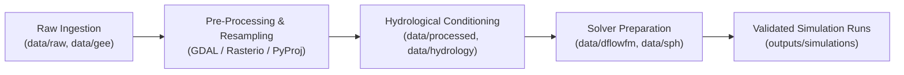

# Scientific Data Provenance & Lineage Standard

## JalRakshak-HD — Quality Assurance and Traceability Policy

Every dataset ingested into **JalRakshak-HD** must have documented provenance, transparent verification levels, and strict scientific integrity. High-definition flood risk simulation, dam-break wave propagation, and disaster response planning depend directly on reliable, verified hydrological, elevation, and terrain data.

---

## 1. Strict Policy on Data Authenticity & Verification Strength

> [!IMPORTANT]
> **NO fabricated scientific inputs are allowed in production simulations.**
>
> Synthetic, hallucinated, or placeholder values must never be used for real dam geometries, hydrographs, digital elevation models, Manning's roughness coefficients, or emergency inundation mapping. All models must execute against verified, authoritative source data.

### Verification Classification Levels:
- **`AUTHORITATIVE_VERIFIED`**: Directly traced to official government records, statutory dam registers (CWC NRLD / CWC Flood Forecasting), published gazettes, or official district administration portals (`erode.nic.in`).
- **`SECONDARY_VERIFIED`**: Validated against regional project documentation, cross-checked with open geospatial layers (e.g., OpenStreetMap relations), but lacking direct public REST geometry shapefiles.
- **`REMOTE_SENSING_DERIVED`**: Derived directly from verified satellite observation missions (e.g., JRC Global Surface Water Landsat archive).
- **`DEM_DERIVED`**: Scientifically computed from authoritative terrain data using documented, peer-reviewed mathematical algorithms (e.g., D8 DAG routing, Priority-Flood filling).
- **`UNVERIFIED`**: Data that cannot yet be traced to an authoritative or secondary validated source (strictly stored as null and excluded from production solvers).

---

## 2. Mandatory Provenance Metadata

Whenever a dataset is added to any subdirectory in `data/`, an accompanying metadata record must capture:

1. **Dataset Name**: Clear, standardized name of the dataset.
2. **Provider / Origin**: Authoritative entity (e.g., CWC, India-WRIS, TNWRD, USGS, NASA, Copernicus).
3. **Official URL / API Access Point**: Direct link, gazette record, or Google Earth Engine Asset ID.
4. **Acquisition Date / Timestamp**: Exact UTC timestamp of collection or query.
5. **Spatial Resolution**: Grid resolution in meters or arc-seconds (e.g., 30m, 10m, 0.5m).
6. **Temporal Resolution**: Time-step or revisit period (e.g., instantaneous, 1-hour, 24-hour, static).
7. **Coordinate Reference System (CRS)**: Projected or Geographic CRS (e.g., EPSG:4326, EPSG:32643).
8. **Verification Level**: Classified as `AUTHORITATIVE_VERIFIED`, `SECONDARY_VERIFIED`, `REMOTE_SENSING_DERIVED`, `DEM_DERIVED`, or `UNVERIFIED`.
9. **Processing Steps / Transformation Log**: Full record of re-projections, clipping, resampling, or hydrological conditioning.
10. **Cryptographic Checksum**: SHA-256 hash of original raw data files to guarantee file integrity.

---

## 3. Data Flow and Processing Lineage

---

## 4. Milestone M1: Study Area & Terrain Provenance Record

### 4.1 Administrative Hierarchy & Regional Authority

| Administrative Level | Name / Designation | Authoritative Source & Verification Level |
| :--- | :--- | :--- |
| **State** | Tamil Nadu | State Government of Tamil Nadu (`AUTHORITATIVE_VERIFIED`) |
| **District** | Erode | [Erode District Portal](https://erode.nic.in) (`AUTHORITATIVE_VERIFIED`) |
| **Revenue Division** | Gobichettipalayam | [Revenue Administration Directory](https://erode.nic.in/revenue-administration/) (`AUTHORITATIVE_VERIFIED`) |
| **Taluk** | Sathyamangalam | [Erode Taluks Directory](https://erode.nic.in/taluks/) (`AUTHORITATIVE_VERIFIED`) |
| **Firka** | Bhavanisagar | Sathyamangalam Revenue Taluk Records (`AUTHORITATIVE_VERIFIED`) |
| **Development Block** | Bhavanisagar Block (Panchayat Union) | Erode Rural Development Agency (`AUTHORITATIVE_VERIFIED`) |
| **Urban Local Body** | Bhavanisagar Town Panchayat | Directorate of Town Panchayats, Tamil Nadu (`AUTHORITATIVE_VERIFIED`) |
| **Assembly Constituency**| Bhavanisagar (SC) — AC No. 107 | Election Commission of India / TN CEO (`AUTHORITATIVE_VERIFIED`) |

### 4.2 Verified Dam & River Metadata

| Attribute | Verified Value | Verification & Authority Details | Verification Level |
| :--- | :--- | :--- | :--- |
| **Dam Name** | Bhavanisagar Dam | Primary name in CWC NRLD & TNWRD | `AUTHORITATIVE_VERIFIED` |
| **Alternate Names** | Lower Bhavani Dam, Bhavani Sagar Project | Registered in India-WRIS & CWC records | `AUTHORITATIVE_VERIFIED` |
| **River** | Bhavani River | Major right-bank tributary of Cauvery River | `AUTHORITATIVE_VERIFIED` |
| **Basin / Sub-basin**| Cauvery Basin / Lower Cauvery | CWC & India-WRIS River Basin Atlas | `AUTHORITATIVE_VERIFIED` |
| **Dam Type** | Earthen Dam with Central Masonry Spillway | NRLD Large Dam Inventory | `AUTHORITATIVE_VERIFIED` |
| **Crest Length** | 8,780 m (8.78 km) | Composite earthen flanks + masonry spillway | `AUTHORITATIVE_VERIFIED` |
| **Maximum Height** | 40.0 m (130.0 ft) | Above deepest foundation level | `AUTHORITATIVE_VERIFIED` |
| **Gross Storage** | 32.8 TMC (928.8 MCM) | Official CWC / TNWRD reservoir capacity | `AUTHORITATIVE_VERIFIED` |
| **Year Completed** | 1955 | Central Water Commission NRLD | `AUTHORITATIVE_VERIFIED` |
| **Dam Coordinates** | `11.47083° N, 77.11389° E` | CWC NRLD State Summary & WRD Project Record | `SECONDARY_VERIFIED` |
| **OSM Spillway Axis**| `11.47326° N, 77.11547° E` | [OpenStreetMap Relation 3831804](https://www.openstreetmap.org/relation/3831804) (Offset: 319.33 m) | `SECONDARY_VERIFIED` |

### 4.3 Engineering Hydraulic Levels vs. SRTM Terrain Elevation

> [!WARNING]
> **Hydraulic Datum & Terrain Context Warning**:
> - **Full Reservoir Level (FRL)** is authoritatively established by **Central Water Commission (CWC)** records at **280.42 m MSL**.
> - The Tamil Nadu state dashboard parameter (**Full Depth = 105.0 ft**) represents local operational water column storage depth above zero-gauge sill datum and is **NOT** an elevation in metres MSL.
> - **Maximum Water Level (MWL)** and **Crest Elevation** in absolute m MSL datum are marked **`UNVERIFIED` (null)** pending official engineering design drawings.
> - **SRTM Ground Elevation (269.75 m MSL)** is a raster terrain sample capturing surface topography at the time of the shuttle radar sweep. It must **NOT** be conflated with the FRL, MWL, crest elevation, or foundation level.

| Hydraulic / Terrain Level | Value | Meaning & Source | Verification Level |
| :--- | :--- | :--- | :--- |
| **Official FRL (CWC)** | **280.42 m MSL** | Authoritative Full Reservoir Level in CWC Flood Forecasting / 2024 Appraisal | `AUTHORITATIVE_VERIFIED` |
| **Reservoir Full Depth** | **105.00 ft** | Local operational water column storage depth above zero-gauge sill datum (TNWRD) | `AUTHORITATIVE_VERIFIED` |
| **Official MWL** | *null* | Pending exact engineering design documentation | `UNVERIFIED` |
| **Official Crest Level** | *null* | Pending exact engineering design documentation | `UNVERIFIED` |
| **SRTM Ground Elevation** | **269.75 m MSL** | Raster cell sample at dam coordinate on `USGS/SRTMGL1_003` (EGM96 Geoid) | `DEM_DERIVED` |

### 4.4 Digital Elevation Model (DEM) Specification

| Property | Value |
| :--- | :--- |
| **Dataset Name** | NASA Shuttle Radar Topography Mission Global 1 Arc-Second (SRTM V3) |
| **Earth Engine Asset ID** | `USGS/SRTMGL1_003` |
| **Provider** | NASA JPL / USGS EROS via Google Earth Engine API (`jalrakshak-hd`) |
| **Native Spatial Resolution** | 1 arc-second (~30.0 metres at equator) |
| **Vertical Reference** | EGM96 Geoid (Orthometric height in metres MSL) |
| **Input Format & CRS** | GeoTIFF (`EPSG:4326` WGS 84 Geographic) |
| **Output Raster Path** | `data/terrain/dem_projected.tif` |
| **Output CRS** | `EPSG:32643` (WGS 84 / UTM zone 43N, Units: metres) |
| **Output Spatial Resolution**| 30.0 m x 30.0 m |
| **Raster Dimensions** | 1718 columns x 826 rows (1,419,068 total cells) |
| **Valid Elevation Range** | Min: 194.1 m MSL \| Max: 1809.7 m MSL \| Mean: 372.22 m MSL |
| **NoData Percentage** | 1.96% (boundary mask) |
| **SHA-256 Checksum** | `12c29b4b08c48b4a2d031bc9a9a7970bff579595028ec485fdbc21d18bb065ef` |
| **Derived Rasters** | `data/terrain/slope.tif` (degrees), `data/terrain/hillshade.tif` (8-bit) |

### 4.5 Area of Interest (AOI) Specification

| Parameter | Specification | Scientific Justification |
| :--- | :--- | :--- |
| **Methodology** | Physically conditioned reach bounding | Covers full reservoir impoundment, dam structure, and downstream river reach through Sathyamangalam. |
| **Upstream Extent** | 15.0 km West-Southwest | Captures reservoir storage body up to inflow convergence. |
| **Downstream Extent** | 35.0 km East-Southeast | Captures primary hydraulic flood wave corridor through Sathyamangalam to rural agricultural plains. |
| **Lateral Buffer** | 12.0 km North-South | Encompasses the entire valley floodplain and Lower Bhavani main canal headworks. |
| **WGS84 Bounding Box** | `[min_lon: 76.9500, min_lat: 11.3600, max_lon: 77.4200, max_lat: 11.5800]` | Defined in [`configs/study_area.yaml`](file:///C:/JalRakshak-HD/configs/study_area.yaml) |
| **Projected Bounds** | `[left: 712621.52m, bottom: 1256471.13m, right: 764161.52m, top: 1281251.13m]` | UTM Zone 43N metric grid |
| **Audit Artifacts** | `outputs/validation/dam_coordinate_audit.json` `outputs/validation/m1_source_manifest.json` `outputs/validation/study_area_verification.json` `outputs/validation/dam_terrain_check.json` `outputs/validation/dem_validation.json` | Generated and validated via Python pipeline |

---

## 5. Milestone M2: Hydrology, River Network, Catchment & Reservoir Geometry (Repaired)

### 5.1 Hydrological Datasets & Geometric Layers

| Layer / Product | Source Dataset & Asset | Provider / Method | Verification Level | Spatial Scope & Metrics |
| :--- | :--- | :--- | :--- | :--- |
| **Downstream Bhavani Mainstem** | OpenStreetMap (Way: 70237216) | OSM Overpass API | `SECONDARY_VERIFIED` | **51.73 km** downstream reach from dam outlet (115.79 m from dam) to AOI boundary (EPSG:32643). |
| **Bhavani River Network Total** | OpenStreetMap (Rel: 326620 / Ways) | OSM Overpass API | `SECONDARY_VERIFIED` | **138.97 km** total network in AOI including Bhavani & Moyar headwaters. |
| **Reservoir Surface Water Extents** | JRC Global Surface Water Mapping Layers v1.4 (`JRC/GSW1_4/GlobalSurfaceWater`) | EC JRC / GEE API | `REMOTE_SENSING_DERIVED` | `multi_decadal_water_occurrence_ge_50`: **31.38 km²**; `persistent_water_core_seasonality_ge_10`: **40.30 km²**. Multi-decadal satellite frequency extent (1984–2021). |
| **Hydrologically Conditioned DEM** | Conditioned FABDEM v1-2 Surface (`dem_hydroconditioned.tif`) | Priority-Flood DAG Routing Engine | `DEM_DERIVED` | 1718x826 grid, 30m resolution. Continuous downhill flow gradient toward domain boundaries. |
| **Flow Direction Raster** | Conditioned DEM D8 Steepest Descent (`flow_direction.tif`) | Priority-Flood DAG Assignment (ESRI codes: 1..128) | `DEM_DERIVED` | Single-direction downslope routing without flat cycles. |
| **Flow Accumulation Raster** | Conditioned D8 Grid Accumulation (`flow_accumulation.tif`) | Topological Upstream Sorting | `DEM_DERIVED` | Units: Integer cells (1 cell = 900 m²). Peak basin accumulation: **1,271,792 cells** (1,144.61 km²). |
| **Derived Stream Network** | Flow Accumulation Threshold >= 1000 cells (`derived_stream_network.gpkg`) | JalRakshak-HD Drainage Extractor | `DEM_DERIVED` | Selected threshold = **1000 cells** (~0.90 km²). Median offset: **43.2 m**, 67.7% within 60 m, 90.4% within 100 m. |
| **Snapped Hydrologic Pour Point** | Thalweg Channel Snap (`hydrologic_pour_point.gpkg`) | Channel distance minimization | `DEM_DERIVED` | Snapped coordinate: `11.470195° N, 77.113911° E` (Snap distance: **70.34 m** < 500m tolerance). Accumulation: **401,407 cells** (361.27 km²). `valid_against_threshold = True`. |
| **Upstream Basin Context** | HydroBASINS Level 12 (`WWF/HydroSHEDS/v1/Basins/hybas_12`) | WWF / HydroSHEDS (Lehner & Grill 2013) | `SECONDARY_VERIFIED` | `HYBAS_ID: 4121595750`, `MAIN_BAS: 4120028760`, `NEXT_DOWN: 4121595720`, `SUB_AREA: 161.8 km²`, `UP_AREA: 4257.7 km²`, `PFAF_ID: 453804030300`, `ORDER: 2`. |
| **Local DEM Catchment** | Local D8 Reverse Routing (`local_catchment.gpkg`) | Snapped pour point reverse flow tracing | `DEM_DERIVED` | Delineated area: **361.27 km²**. Boundary evaluation: Upstream flow enters from outside DEM. Status: **`catchment_truncated = True`**, **`local_catchment_validity = INVALID_FOR_TOTAL_UPSTREAM_AREA`**. |
| **River Longitudinal Profile** | 100m interval DEM sampling (`river_profile.csv`) | Downstream mainstem over conditioned DEM | `DEM_DERIVED` | Length: **51.70 km**, Start elev: **267.66 m MSL** (dist to dam: 115.79 m, below FRL 280.42 m), End elev: **195.00 m MSL**, Net fall: **72.66 m**, Avg slope: **1.405 m/km**. |

### 5.2 Scientific Delineation Note on Upstream Nilgiri Catchment vs Local AOI

> [!IMPORTANT]
> **Catchment Truncation & Basin Hierarchy Integrity**:
> - The local DEM-delineated catchment (`local_catchment.gpkg`) covers only the direct terrain drainage within the M1 30m DEM domain (361.27 km²) and is explicitly marked **`catchment_truncated = true`** and **`local_catchment_validity = "INVALID_FOR_TOTAL_UPSTREAM_AREA"`**.
> - The true upstream Bhavani hydrological catchment spans **4,257.7 km²** across the Nilgiris and Western Ghats (Moyar, Kundah, and Upper Bhavani tributaries).
> - This full regional upstream basin is tracked independently via `upstream_basin.gpkg` (HydroBASINS Level 12 `HYBAS_ID: 4121595750`) to prevent artificial claims of full watershed delineation from a bounded hydraulic DEM.

---

## 6. Milestone M3: Dam Engineering & Breach Event Definition (Final Source Reconciliation)

### 6.1 Dam Structural Components & Preserved Source Variations

| Component / Field | Value | Unit | Verification Level | Source & Lineage |
| :--- | :--- | :--- | :--- | :--- |
| **Official Dam Name** | Bhavanisagar Dam | - | `AUTHORITATIVE_VERIFIED` | Central Water Commission (NRLD 2019 / PIC: TN12HH0014) |
| **Dam Classification** | Composite (Earthen Embankment + Masonry Spillway) | - | `AUTHORITATIVE_VERIFIED` | CWC National Register of Large Dams |
| **NRLD Dam Length (Source A)** | 8,797.0 | m | `AUTHORITATIVE_VERIFIED` | CWC NRLD 2019 (PIC: TN12HH0014) |
| **NRLD Height above Lowest Foundation (Source A)** | 62.0 | m | `AUTHORITATIVE_VERIFIED` | CWC NRLD 2019 (PIC: TN12HH0014) |
| **Technical Project Dam Length (Source B)** | 8,780.0 | m | `SECONDARY_VERIFIED` | Lower Bhavani Project Technical Description |
| **Central Masonry Section Length** | 464.0 | m | `SECONDARY_VERIFIED` | Lower Bhavani Project Technical Description |
| **Masonry Height from Lowest Foundation** | 62.18 | m | `SECONDARY_VERIFIED` | Lower Bhavani Project Technical Description (204 ft) |
| **Ogee Spillway Crest Length** | 120.70 | m | `SECONDARY_VERIFIED` | 9 bays × 10.97 m gate width + piers (distinct from 464 m masonry section) |
| **Spillway Crest Sill Level** | 274.32 | m MSL | `SECONDARY_VERIFIED` | TNWRD Lower Bhavani Dam Operations Manual (900.0 ft MSL) |
| **Spillway Radial Gates** | 9 | count | `AUTHORITATIVE_VERIFIED` | CWC NRLD / TNWRD Spillway Gate Schedule |
| **Spillway Gate Clear Size** | 10.97 × 6.10 | m | `SECONDARY_VERIFIED` | TNWRD Gate Schedule (36 ft × 20 ft) |
| **Spillway Design Discharge Capacity** | 3,455.0 | m³/s | `SECONDARY_VERIFIED` | TNWRD Spillway Rating Schedule (~122,000 cfs) |
| **Earthen Embankment Reported Height** | 40.0 | m | `SECONDARY_VERIFIED` | Representative embankment height above riverbed (~130 ft) |
| **Arithmetic Embankment Length (Derived)** | 8,316.0 | m | `MODEL_DERIVED_APPROXIMATION` | Subtraction: 8,780 m (Technical Length) - 464 m (Masonry Section) |
| **Left / Right Embankment Flank Lengths** | null | m | `UNVERIFIED` | Individual flank split unverified in public literature |
| **Full Reservoir Level (FRL)** | 280.42 | m MSL | `AUTHORITATIVE_VERIFIED` | CWC Flood Forecasting / 2024 Appraisal Report |
| **Reservoir Full Depth** | 105.0 | ft | `AUTHORITATIVE_VERIFIED` | Tamil Nadu WRD Daily Reservoir Bulletin |
| **CWC 2020 Storage Record** | Gross: 929.0, Live: 780.5 | MCM | `AUTHORITATIVE_VERIFIED` | CWC Hydrological Data Book 2020 (Cauvery Basin) |
| **State Feasibility Storage Record** | Gross: 929.0, Live: 908.0 | MCM | `SECONDARY_VERIFIED` | TN State Feasibility / Project Operating Quota (32.0 TMC live) |
| **Preferred Live Storage for Breach Model** | null | MCM | `UNVERIFIED` | Kept null pending physical stage-storage rating & invert datum |
| **Assumed Breach Active Volume ($V_w$)** | 780.50 | MCM | `MODEL_ASSUMPTION_FIRST_ESTIMATE` | Initial sensitivity reference based on CWC 2020 live storage |
| **Assumed Final Breach Height ($h_b$)** | 40.0 | m | `MODEL_ASSUMPTION_FIRST_ESTIMATE` | Hypothetical complete-breach depth assumption (not max dam height) |
| **Assumed Water Depth ($h_w$)** | 32.0 | m | `MODEL_ASSUMPTION_FIRST_ESTIMATE` | Full depth (105 ft = 32.004 m) above dead sill datum |
| **Volume Above Final Breach Invert** | null | m3 | `UNVERIFIED` | Kept null pending stage-storage curve & invert datum |
| **Maximum Water Level (MWL)** | null | m MSL | `UNVERIFIED` | Kept null to prevent speculative overtopping heads |
| **Structural Crest Elevation** | null | m MSL | `UNVERIFIED` | Kept null to prevent fabricated freeboard |
| **Elevation-Storage Curve** | UNAVAILABLE | - | `UNVERIFIED` | No synthetic level-pool curve manufactured |

### 6.2 Empirical Dam-Breach Formulation Library

| Model Formulation | Published Literature Reference | Equations & Predictors | Parameter Outputs (Bhavanisagar) | Verification Level / Status |
| :--- | :--- | :--- | :--- | :--- |
| **Froehlich (2008)** (Baseline) | Froehlich, D. C. (2008). *Embankment Dam Breach Parameters and Their Uncertainties*, ASCE J. Hydraul. Eng., 134(12), 1708–1721. | $B_{avg} = 0.27 K_0 V_w^{0.32} h_b^{0.04}$ $t_f = 63.2 \sqrt{V_w / (g h_b^2)}$ | $B_{avg} = 219.28\text{ m}$ ($K_0=1.0$) $t_f = 14,095.59\text{ s}$ ($3.915\text{ hr}$) $z = 1.0\text{ H}:1\text{ V}$ | `MODEL_DERIVED` `VALID_WITH_EXTRAPOLATION` ($V_w > 660\text{ MCM}$) |
| **Von Thun & Gillette (1990)** (Sensitivity) | Von Thun, J. L., & Gillette, D. R. (1990). *Guidance on Breach Parameters*, USBR Unpublished Internal Report, Denver, CO. | $B_{avg} = 2.5 h_w + C_b$ $t_f = B_{avg} / (4 h_w)$ | $B_{avg} = 134.90\text{ m}$ ($C_b=54.9\text{ m}$) $t_f = 3,794.06\text{ s}$ ($1.054\text{ hr}$) $z = 0.5\text{ H}:1\text{ V}$ | `MODEL_DERIVED` `VALID` |
| **MacDonald & Langridge-Monopolis (1984)** | MacDonald, T. C., & Langridge-Monopolis, J. (1984). *Breaching Characteristics of Dam Failures*, ASCE J. Hydraul. Eng., 110(5), 567–586. | $V_{er} = 0.0261 (V_{out} h_w)^{0.769}$ $t_f = 0.0179 V_{er}^{0.364}$ | $V_{er} = 2,584,256.4\text{ m}^3$ $t_f = 13,907.39\text{ s}$ ($3.863\text{ hr}$) $B_{avg} = \text{null}$ | `MODEL_DERIVED` `INSUFFICIENT_CROSS_SECTION_GEOMETRY` |

### 6.3 Spatial Breachable Component & Scenario Lineage
- **Breached Component**: Left Earthen Embankment Flank, preserving the central 464 m concrete/masonry gravity section as rigid monolith.
- **Candidate Breach Location**: $11.473220^\circ\text{ N}, 77.112500^\circ\text{ E}$ (`EPSG:4326`) / $730,450.10\text{ m E}, 1,269,149.74\text{ m N}$ (`EPSG:32643`, UTM Zone 43N).
- **Offset from Metadata Dam Point**: $304.87\text{ m}$ NNW along embankment axis.
- **Verification Level**: `MODEL_DERIVED_CANDIDATE_LOCATION`.
- **Physical Feasibility Check**: Reference breach width ($219.28\text{ m}$) represents $2.6\%$ of approximate total embankment length ($8,316\text{ m}$), fully satisfying spatial boundary conditions.

---

## 7. Milestone M4: Breach Outflow Hydrograph Generation

### 7.1 Methodological Classification and Scientific Principles
- **Hydrograph Synthesis Method**: `VOLUME_CONSTRAINED_TRIANGULAR_SCREENING_HYDROGRAPH`
- **Scientific Classification**: `SCREENING_HYDROGRAPH`
- **Dynamic Reservoir Routing**: `NOT_CLAIMED_LEVEL_POOL_ROUTING_UNAVAILABLE` (Stage-storage curve is unavailable).
- **Volume Conservation Law**: Mathematical constraint where total duration $T_{\text{total}} = \frac{2 V_w}{Q_{\text{peak}}}$, ensuring $\int_0^T Q(t)\,dt = V_w$ with zero artificial recession invention.

### 7.2 Peak Outflow Regressions & Inputs Lineage

| Parameter / Model | Exact Formula / Value | Verification Level | Literature / Source Reference | Limitations & Status |
| :--- | :--- | :--- | :--- | :--- |
| **Reference $V_w$** | $780.50\text{ MCM}$ ($780,500,000\text{ m}^3$) | `MODEL_ASSUMPTION_FIRST_ESTIMATE` | CWC Hydrological Data Book 2020 Live Storage | Operational live volume proxy |
| **Reference $h_w$** | $32.00\text{ m}$ ($105.0\text{ ft}$) | `MODEL_ASSUMPTION_FIRST_ESTIMATE` | TNWRD Daily Bulletin Full Depth | Assumes breach cuts to riverbed datum |
| **Reference $h_b$** | $40.00\text{ m}$ | `MODEL_ASSUMPTION_FIRST_ESTIMATE` | M3 Flank Section Definition | Total hypothetical breach height |
| **Froehlich (1995) $Q_p$** | $Q_p = 0.607 \cdot V_w^{0.295} \cdot h_w^{1.24} = \mathbf{18,742.38\text{ m}^3/\text{s}}$ | `PUBLISHED_EMPIRICAL_RELATIONSHIP` | Froehlich, D. C. (1995) ASCE Conf. / USBR DSO-98-004 Eq. 2 | Extrapolated beyond 660 MCM dataset max |
| **Froehlich (1995) $t_f$** | $t_f = 0.00254 \cdot V_w^{0.53} \cdot h_b^{-0.9} = \mathbf{17,070.25\text{ s}}$ ($4.742\text{ hr}$) | `PUBLISHED_EMPIRICAL_RELATIONSHIP` | Froehlich, D. C. (1995) ASCE Conf. / USBR DSO-98-004 Eq. 3 | Same-family diagnostic comparison |
| **MacDonald / Wahl $Q_p$** | $Q_p = 1.154 \cdot (V_w \cdot h_w)^{0.412} = \mathbf{22,181.21\text{ m}^3/\text{s}}$ | `PUBLISHED_EMPIRICAL_RELATIONSHIP` | MacDonald (1984) / Wahl (1998 Table 5, 2004 Eq. 6) | Upper-envelope peak flow sensitivity |

### 7.3 Multi-Scenario Hydrograph Register

| Scenario ID | Hydrograph Classification | Geometry Model | Peak Model | $Q_p$ (m³/s) | Rise Time (hr) | Total Duration (hr) | Target $V_w$ (MCM) | Integ. $V_w$ (MCM) | Vol Error | Status |
| :--- | :--- | :--- | :--- | :--- | :--- | :--- | :--- | :--- | :--- | :--- |
| **`BHV_BASE`** | `SCREENING_HYDROGRAPH` | Froehlich (2008) | Froehlich (1995) | **18,742.38** | 3.915 | 23.135 | 780.50 | 780.50 | 0.0000% | **PASS** |
| **`BHV_FROEHLICH95_DIAGNOSTIC`** | `SCREENING_HYDROGRAPH` | Froehlich (1995) | Froehlich (1995) | **18,742.38** | 4.742 | 23.135 | 780.50 | 780.50 | 0.0000% | **PASS** |
| **`BHV_PEAK_SENSITIVITY_MLM`** | `SCREENING_HYDROGRAPH` | MacDonald (1984) | MacDonald / Wahl (1998) | **22,181.21** | 3.863 | 19.549 | 780.50 | 780.50 | 0.0000% | **PASS** |

### 7.4 Boundary Forcing Products for D-Flow FM (Milestone M5 Preparation)
- `data/dflowfm/hydrographs/BHV_BASE.csv`
- `data/dflowfm/hydrographs/BHV_BASE_boundary.tim`
- `data/dflowfm/hydrographs/BHV_FROEHLICH95_DIAGNOSTIC.csv`
- `data/dflowfm/hydrographs/BHV_FROEHLICH95_DIAGNOSTIC_boundary.tim`
- `data/dflowfm/hydrographs/BHV_PEAK_SENSITIVITY_MLM.csv`
- `data/dflowfm/hydrographs/BHV_PEAK_SENSITIVITY_MLM_boundary.tim`

---

## 8. Milestone M5: 2D Hydrodynamic Flood Routing (D-Flow FM)

### 8.1 Model Classification and Scientific Boundary Conditions
- **Model Classification**: `2D_DFLOWFM_SCREENING_INUNDATION_MODEL`
- **Solver Engine**: Delft3D FM Suite 2026.02 (D-Flow FM 1.2.184 / DIMR 2.00)
- **Terrain Elevation Lineage**: NASA SRTM 30m Projected Surface (`EPSG:32643`). Notice: Captures radar surface/canopy; does not resolve underwater bathymetric channel incising.
- **Initial Condition**: `DRY_START_SCREENING` (`MODEL_ASSUMPTION_NUMERICAL_INITIAL_CONDITION`)
- **Downstream Boundary**: Non-reflective Riemann boundary condition (`riemannbnd`, `MODEL_ASSUMPTION_BOUNDARY_CONDITION`)

### 8.2 Mesh & Computational Parameters Lineage

| Parameter / Layer | Value / Specification | Provenance & Source | Verification Level |
| :--- | :--- | :--- | :--- |
| **Computational Domain** | 818.37 km² (`data/dflowfm/model/domain.gpkg`) | Split from M1 AOI along dam toe axis | `MODEL_DERIVED` |
| **2D Mesh Topology** | 82,895 nodes, 165,203 edges, 82,309 faces | UGRID 2D rectilinear grid via `meshkernel` | `MODEL_DERIVED` |
| **Mesh Resolution** | 100.0 m × 100.0 m | Conforms to laptop RAM limit (<150k faces) | `MODEL_DERIVED` |
| **Mesh Elevation Range** | Min: 194.17 m, Max: 1350.73 m, Mean: 300.64 m MSL | Nearest-neighbor interpolated from M1 DEM | `DEM_DERIVED` |
| **Hydraulic Roughness** | Uniform Manning $n = 0.035\text{ s/m}^{1/3}$ | Chow (1959) / Barnes (1967) natural floodplain | `MODEL_ASSUMPTION` |
| **Upstream Forcing** | `BHV_BASE.bc` ($Q_{\text{peak}} = 18,742.38\text{ m}^3/\text{s}$, $V = 780.5\text{ MCM}$) | M4 Volume-Constrained Screening Hydrograph | `SCREENING_HYDROGRAPH` |
| **Simulation Duration** | 30.0 Hours (108,000 s) | Extended past 23.13 hr hydrograph end | `MODEL_RUN_WINDOW` |

### 8.3 Generated Simulation Products & GIS Datasets
- Map NetCDF Output: `outputs/simulations/dflowfm/BHV_BASE/Bhavanisagar_DamBreak_map.nc`
- History NetCDF Output: `outputs/simulations/dflowfm/BHV_BASE/Bhavanisagar_DamBreak_his.nc`
- Maximum Inundation Depth: `outputs/simulations/dflowfm/BHV_BASE/max_water_depth.tif`
- Maximum Flow Velocity: `outputs/simulations/dflowfm/BHV_BASE/max_velocity.tif`
- Wave Arrival Time Isochrones: `outputs/simulations/dflowfm/BHV_BASE/arrival_time.tif`
- Inundation Extent Polygon: `outputs/simulations/dflowfm/BHV_BASE/inundation_extent.gpkg`
- Observation Station Hydrographs: `outputs/simulations/dflowfm/BHV_BASE/observation_hydrographs.csv`

---

## 9. Milestone M6: DualSPHysics Near-Field Dam-Break Particle Simulation

### 9.1 Model Classification & Scope Boundaries
- **Model Classification**: `2D_UNIT_WIDTH_NEAR_FIELD_SPH_SCREENING_MODEL`
- **Simulation Purpose**: Near-field high-energy hydrodynamic screening of initial breach efflux and gorge wave propagation (0.0 to 1.5 km downstream).
- **Physical Scope**: 2D longitudinal unit-width plane following real Bhavani River mainstem chainage.
- **Solver Engine**: DualSPHysics v5.4.355 (`DualSPHysics5.4CPU_win64.exe`) via OpenMP CPU parallelization (16 threads).

### 9.2 Provenance of Numerical & Hydraulic Inputs

| Parameter / Input | Value / Specification | Lineage & Derivation | Verification Classification |
| :--- | :--- | :--- | :--- |
| **Dam Site Coordinates** | 11.47083° N, 77.11389° E | CWC India-WRIS / Erode District Registry | `SECONDARY_VERIFIED` |
| **Projected Coordinate Datum** | EPSG:32643 (UTM Zone 43N, m) | Global transform mapped to local SPH chainage | `AUTHORITATIVE_VERIFIED` |
| **Near-Field Reach Extent** | 1,500.0 m (1.5 km reach) | Traced along Bhavani mainstem (`data/sph/nearfield_centerline.gpkg`) | `MODEL_DERIVED` |
| **Bed Elevation Profile** | 151 sampled nodes ($s \in [0, 1500]\text{ m}$) | Sampled from M1 NASA SRTM 30m Projected DEM | `DEM_DERIVED` |
| **Sub-Grid Bathymetry** | No underwater incision survey | SRTM surface elevation without artificial bed carving | `SRTM_SURFACE_TOPOGRAPHY` |
| **Reservoir FRL** | 280.42 m MSL | Central Water Commission (CWC) Official Record | `AUTHORITATIVE_VERIFIED` |
| **Breach Toe Elevation** | 262.894 m MSL | SRTM DEM bed elevation at breach origin ($s = 0.0\text{ m}$) | `DEM_DERIVED` |
| **Release State Depth ($h_{\text{rel}}$)** | $17.526\text{ m}$ ($280.42 - 262.894\text{ m}$) | Screening column height relative to local bed | `MODEL_ASSUMPTION_DEM_DERIVED` |
| **Source Peak Discharge ($Q_p$)** | $18,742.38\text{ m}^3/\text{s}$ | M4 Froehlich (1995) Empirical Dam-Break Peak | `MODEL_DERIVED` |
| **Average Breach Width ($B_{avg}$)** | $219.28\text{ m}$ | M3 Froehlich (2008) Empirical Breach Geometry | `MODEL_DERIVED` |
| **Unit-Width Discharge ($q_p$)** | $85.4724\text{ m}^2/\text{s}$ ($18,742.38 / 219.28$) | Exact mathematical division | `MODEL_DERIVED` |
| **Release State Velocity ($u_{\text{rel}}$)** | $4.877\text{ m/s}$ ($85.4724 / 17.526$) | Continuity equation ($q_p / h_{\text{rel}}$) | `MODEL_DERIVED` |
| **Forcing Classification** | `PEAK_STATE_INITIALIZED_RELEASE_SCREENING_CASE` | Initialized upstream reservoir fluid block | `MODEL_ASSUMPTION_NUMERICAL` |
| **Particle Spacing ($\Delta p$)** | $1.0\text{ m}$ | Selected from resolution study ($dp=4\text{ m}, 2\text{ m}, 1\text{ m}$) | `NUMERICAL_DISCRETIZATION` |
| **Particle Count** | 10,982 (4,182 boundary, 6,800 fluid) | Strictly below 1,500,000 particle safety threshold | `NUMERICAL_DISCRETIZATION` |
| **SPH Kernel & Viscosity** | Quintic Wendland, Artificial $\alpha = 0.02$ | Monaghan (1992) / Wendland (1995) standard defaults | `SOLVER_DEFAULT` |
| **Density Diffusion Term** | Fourtakas (DDT = 2, value = 0.1) | Fourtakas et al. (2019) SPH turbulence stabilization | `SOLVER_DEFAULT` |

### 9.3 Generated SPH Datasets and Diagnostic Products
- SPH Centerline: `data/sph/nearfield_centerline.gpkg`
- Bed Elevation Profile: `data/sph/nearfield_bed_profile.csv`
- Coordinate Transformation: `data/sph/local_coordinate_transform.json`
- Case Geometry XML & STL: `data/sph/BHV_BASE_NEARFIELD/CaseBhavani_Def.xml`, `bed_profile.stl`
- Numerical Gauge Results: `outputs/simulations/sph/BHV_BASE_NEARFIELD/gauge_results.csv`
- Flood Front Propagation: `outputs/simulations/sph/BHV_BASE_NEARFIELD/front_propagation.csv`
- Particle VTK Snapshots: `outputs/simulations/sph/BHV_BASE_NEARFIELD/particles/`
- Solver Manifest & Balance: `outputs/validation/m6_model_manifest.json`, `m6_mass_particle_balance.json`
- Diagnostic Maps:
  - `outputs/maps/m6_nearfield_profile.png`
  - `outputs/maps/m6_domain_profile.png`
  - `outputs/maps/m6_peak_velocity.png`
  - `outputs/maps/m6_peak_depth.png`
  - `outputs/maps/m6_front_propagation.png`

---

## 10. Milestone M7: Cross-Solver Near-Field Comparison and Hybrid Coupling Design

### 10.1 Comparison Classification & Core Principles
- **Comparison Classification**: `CROSS_SOLVER_CONSISTENCY_ANALYSIS`
- **Forcing Classification**: `NON_EQUIVALENT_FORCING_COMPARISON`
- **Forcing Equivalence**: `FALSE` for all comparison stations
- **Validation Principle**: Cross-solver comparison is **NOT** model validation because neither solver serves as observed ground truth. Differences between models represent **cross-model spread** arising from non-equivalent forcing histories, dimensionality, and governing physics—**not solver error**.

### 10.2 Model Classification & Spatial Framework
- **D-Flow FM Classification**: `2D_DFLOWFM_SCREENING_INUNDATION_MODEL` (82,309 faces, ~100 m nominal cell dimension, SRTM 30 m terrain, 818.37 km² domain, 51.73 km reach).
- **DualSPHysics Classification**: `2D_UNIT_WIDTH_NEAR_FIELD_SPH_SCREENING_MODEL` (10,982 particles, $dp = 1.0$ m nominal resolution, 1500 m reach along river centerline).
- **Common Spatial Reference**: `data/comparison/common_nearfield_centerline.gpkg` and `data/comparison/common_gauges.gpkg` (EPSG:32643 UTM Zone 43N).
- **Common Gauge Network**: 5 stations at 100 m, 250 m, 500 m, 1000 m, 1500 m chainage.

### 10.3 Cross-Solver Hydrodynamic Findings
- **Depth Trend**: `PARTIALLY_CONSISTENT` (Both models reproduce localized peak depth pooling at 250 m toe depression; downstream depths diverge as continuous hydrograph fills valley in D-Flow while finite fluid mass attenuates in SPH).
- **Velocity Trend**: `DIVERGENT_TREND` (SPH shows strong attenuation after the near-dam jet region [$24.73 \rightarrow 15.95 \rightarrow 14.00$ m/s], whereas D-Flow depth-averaged peak velocity increases farther downstream in the sampled reach [$2.47 \rightarrow 2.51 \rightarrow 2.65 \rightarrow 4.32 \rightarrow 4.45$ m/s]. This is not solver error because forcing and dimensional formulations are non-equivalent).
- **Front Propagation Status**: SPH front reached 1280.41 m by 600 s and the 1500 m station was `NOT_REACHED_WITHIN_600_S` (it was slowing substantially but was still advancing).
- **Hydraulic Regimes (Synchronized at Peak Velocity Timestamp)**:
  - DualSPHysics: Supercritical shooting flow ($Fr \approx 2.22$–$3.17$) driven by steep gravity plunge.
  - D-Flow FM: Subcritical tranquil routing ($Fr \approx 0.49$–$0.72$) governed by depth-averaged shallow-water resistance.
- **Sediment & Scour Boundaries**: DualSPHysics M6 does not include sediment transport or morphological scour; near-field velocities are evaluated as relevant to potential erosion/scour assessment on immediate structures.

### 10.4 Hybrid Solver Architecture & Coupling Readiness
- **Architectural Status**: `DESIGN_ONLY` (`configs/hybrid_solver.yaml`)
- **Direct Numerical Coupling Activated**: `NO`
- **Recommended Future Handoff Candidate**: `500 m` (`station_id = G_500m`, preferred design candidate only; direct numerical coupling is presently not possible).
- **Direct Discharge Coupling Ready**: `false` (`UNIT_WIDTH_TO_FULL_WIDTH_SCALING_UNRESOLVED`)
- **Overall Coupling Readiness**: `NOT_READY`
- **Coupling Readiness Blockers**:
  1. Unit-width to full-width scaling unresolved (cannot multiply unit discharge by arbitrary valley width).
  2. Forcing histories differ (continuous 30-hour hydrograph vs. finite peak block).
  3. Time origins differ ($t_0$ at hydrograph start vs. $t_0$ at release).
  4. DualSPHysics particle resolution sensitivity is `NOT_STABILIZED`.

### 10.5 Generated Datasets & Comparison Artifacts
- Common Centerline: `data/comparison/common_nearfield_centerline.gpkg`
- Common Gauges: `data/comparison/common_gauges.gpkg`
- D-Flow Gauge Metrics: `outputs/comparison/dflow_nearfield_gauges.csv`
- SPH Normalized Gauges: `outputs/comparison/sph_nearfield_gauges.csv`
- Depth Comparison Table: `outputs/comparison/depth_comparison.csv`
- Velocity Comparison Table: `outputs/comparison/velocity_comparison.csv`
- Normalized Spatial Profiles: `outputs/comparison/normalized_spatial_profiles.csv`
- Hydraulic Regime Comparison: `outputs/comparison/hydraulic_regime_comparison.csv`
- Arrival Time Context: `outputs/comparison/arrival_time_context.csv`
- Validation & Manifests:
  - `outputs/validation/m7_dflow_sampling_validation.json`
  - `outputs/validation/m7_time_reference_audit.json`
  - `outputs/validation/m7_cross_model_statistics.json`
  - `outputs/validation/m7_handoff_candidates.json`
  - `outputs/validation/m7_comparison_manifest.json`
- Diagnostic Visualizations:
  - `outputs/maps/m7_common_gauges.png`
  - `outputs/maps/m7_depth_comparison.png`
  - `outputs/maps/m7_velocity_comparison.png`
  - `outputs/maps/m7_normalized_depth.png`
  - `outputs/maps/m7_normalized_velocity.png`

---

## 11. Milestone M8 — HADR Consequence, Exposure and Emergency-Priority Analysis

### 11.1 Dataset Lineage & Acquisition
1. **Hydraulic Inundation Model Source:**
   - Source: Milestone M5 D-Flow FM 2D Simulation (`outputs/simulations/dflowfm/BHV_BASE/Bhavanisagar_DamBreak_map.nc`).
   - Classification: `2D_DFLOWFM_SCREENING_INUNDATION_MODEL`.
   - Resolution: 82,309 flexible mesh faces, 181 timesteps (10 min intervals over 30.0 hr).
2. **Hazard Severity Standard:**
   - Standard: Central Water Commission (CWC) / Australian Disaster Resilience Guideline 7-3 (Smith, Davey, Cox, 2014).
   - Method: `TIME_SYNCHRONOUS_STEPWISE_EVALUATION` at each identical timestep $t$.
   - Classes: H1 ($D\cdot V \le 0.3$), H2 ($D\cdot V \le 0.6, D\le 0.5$), H3 ($D\cdot V \le 0.6, D\le 1.2$), H4 ($D\cdot V \le 1.0, D\le 2.0$), H5 ($D\cdot V \le 4.0, D\le 4.0, V\le 4.0$), H6 ($D\cdot V > 4.0$ or $D > 4.0$ or $V > 4.0$).
3. **Gridded Population:**
   - Primary: WorldPop 2020 UN-Adjusted Global 100m Grid (`WorldPop/GP/100m/pop/IND_2020`), reprojected with sum-conservation to EPSG:32643 (sum = 249,913.5).
   - Cross-check: GHSL GHS-POP R2023A 100m Grid (`JRC/GHSL/P2023A/GHS_POP/2025`), reprojected with sum-conservation to EPSG:32643 (sum = 385,064.9).
   - Divergence: Documented as `DATASET_SPREAD` (Ratio GHSL/WorldPop = 1.99).
4. **Building Footprints:**
   - Provider: Google Research Open Buildings v3 Polygons (`GOOGLE/Research/open-buildings/v3/polygons`, confidence $\ge 0.75$).
   - Total acquired in reach: 43,470 footprints. Inundated: 25,652 footprints (2.27 km² footprint area).
   - Structural vulnerability: 22,472 buildings in H5/H6 designated `H5_H6_STRUCTURAL_DAMAGE_EXPOSURE` (not assumed destroyed).
5. **Land Cover:**
   - Provider: ESA WorldCover 2021 v200 (`ESA/WorldCover/v200/2021`, 10m global land cover).
   - Inundated Cropland (Class 40): 39.66 km² (38.06 km² in severe H3–H6).
   - Inundated Built-up (Class 50): 7.86 km² (7.66 km² in severe H3–H6).
6. **Transportation & Critical Infrastructure:**
   - Provider: OpenStreetMap (OSM) via Overpass API / Nominatim.
   - Roads: 243.82 km inundated (226.35 km severe H3–H6), classified as `HYDRAULICALLY_EXPOSED_ROAD_SEGMENT`.
   - Bridges: 20 screened bridges, classified as `BRIDGE_HYDRAULIC_EXPOSURE_SCREENING`.
   - Critical Facilities: 13 facilities (10 healthcare, 1 education, 2 community assembly).
7. **HADR Response Priority Zones:**
   - Standard: `OPERATIONAL_SCREENING_PRIORITY_ORDER`.
   - Deterministic sorting rule: 1) max hazard (H6>H5>H4>H3), 2) earlier arrival time, 3) larger population at risk.
   - Ranks: Zone 1 (Bhavanisagar toe, 0.17h), Zone 2 (Sathyamangalam urban core, 0.67h), Zone 3 (Kodiveri, 3.00h), Zone 4 (Bhavani, 5.00h), Zone 5 (Gobichettipalayam floodplain, 6.67h), Zone 6 (Lower confluence, 8.67h).

### 11.2 Output Manifest
- Data Layers:
  - `outputs/hadr/hazard_severity.gpkg`
  - `outputs/hadr/severity_arrival_times.gpkg`
  - `outputs/hadr/hazard_class.tif`
  - `outputs/hadr/max_depth_velocity_product.tif`
  - `outputs/hadr/arrival_time_h3.tif`
  - `outputs/hadr/arrival_time_h5.tif`
  - `outputs/hadr/population_exposure_by_hazard.csv`
  - `outputs/hadr/population_arrival_context.csv`
  - `outputs/hadr/building_exposure.gpkg`
  - `outputs/hadr/building_exposure_by_hazard.csv`
  - `outputs/hadr/landcover_exposure_by_hazard.csv`
  - `outputs/hadr/road_exposure.gpkg`
  - `outputs/hadr/road_exposure_by_hazard.csv`
  - `outputs/hadr/bridge_exposure.csv`
  - `outputs/hadr/critical_facility_exposure.csv`
  - `outputs/hadr/response_zones.gpkg`
  - `outputs/hadr/hadr_priority_zones.csv`
- Validation & Manifests:
  - `outputs/validation/m8_hazard_severity_summary.json`
  - `outputs/validation/m8_population_crosscheck.json`
  - `outputs/validation/m8_exposure_summary.json`
  - `outputs/validation/m8_source_manifest.json`
  - `outputs/validation/m8_uncertainty_manifest.json`
  - `outputs/validation/m8_validation_results.json`
  - `outputs/reports/m8_hadr_summary.md`
- Diagnostic Maps:
  - `outputs/maps/m8_hazard_classes.png`
  - `outputs/maps/m8_population_exposure.png`
  - `outputs/maps/m8_building_exposure.png`
  - `outputs/maps/m8_critical_facilities.png`
  - `outputs/maps/m8_road_exposure.png`
  - `outputs/maps/m8_hadr_priority_zones.png`

---

## 12. Milestone M9: Earth Observation, Historical Flood Benchmark & NRT Monitoring

### 12.1 Primary Remote Sensing Data Sources & Threshold Governance
1. **Sentinel-1 C-SAR GRD (`COPERNICUS/S1_GRD`):**
   - Provider: European Space Agency (ESA) / Copernicus Programme.
   - Mode: Interferometric Wide (IW), 10m spatial resolution, dual polarization (VV + VH).
   - Orbit Geometry: Relative Orbit 165, DESCENDING pass (strict orbit consistency enforced).
   - Historical Scenes:
     - Pre-event: `S1B_IW_GRDH_..._20190717T003951_..._54B5`, `S1B_IW_GRDH_..._20190729T003951_..._61C1`
     - Event peak: `S1B_IW_GRDH_..._20190810T003943_..._799A`
     - Post-event: `S1B_IW_GRDH_..._20190822T003944_..._D69D`
   - Threshold Governance:
     - $\Delta \sigma^0_{\text{VV}} \le -3.0$ dB with $\sigma^0_{\text{VV}} \le -14.0$ dB (`PUBLISHED_LITERATURE` / Twele et al., 2016; UN-SPIDER, 2019).
     - Absolute $\sigma^0_{\text{VV}} \le -15.5$ dB, $\sigma^0_{\text{VH}} \le -23.0$ dB (`DATA_DERIVED_HISTOGRAM` / Martinis et al., 2015).
2. **Terrain Slope Masking:**
   - Source: USGS SRTMGL1_003 (30m DEM).
   - Threshold: $\text{Slope} \le 5.0^\circ$ (`PUBLISHED_LITERATURE` / UN-SPIDER, 2019; removes 13.8% of steep-slope radar shadow artifacts).
3. **Historical Recurrent Water Baseline (`JRC/GSW1_4/GlobalSurfaceWater`):**
   - Provider: European Commission Joint Research Centre (JRC).
   - Threshold: $\text{Occurrence} \ge 50\%$ (separates historically recurrent water from new flood expansion; Pekel et al., 2016).
   - Baseline water area: **3.103 km²**.
4. **Sentinel-2 MSI Optical Cross-Check (`COPERNICUS/S2_SR_HARMONIZED`):**
   - Provider: ESA / Copernicus Programme.
   - Status: `CLOUD_LIMITED` (mean cloud cover 94.5% during active August 2019 monsoon episode; synthetic cloud-free optical evidence is NOT fabricated).
5. **CHIRPS Daily Precipitation (`UCSB-CHG/CHIRPS/DAILY`):**
   - Provider: Climate Hazards Center, UC Santa Barbara.
   - Resolution: 0.05° (~5.5 km).
   - Event accumulation (Aug 1–20, 2019): **113.86 mm** (3-day pre-peak: 23.74 mm).
   - Classification: `REMOTE_SENSING_RAINFALL_CONTEXT` (context only; strictly NOT converted to discharge).
6. **Historical Event Verification:**
   - Source: Central Water Commission (CWC) Daily Flood Situation Reports (August 2019) & TNSDMA.
   - Event Name: `AUGUST_2019_BHAVANI_FLOOD_BHAVANISAGAR_INFLOW_EVENT`.
   - Officially Documented Flood Period: August 08–16, 2019.
   - Classification: `HISTORICAL_FLOOD_REMOTE_SENSING_BENCHMARK`.
7. **Spatial Context Comparison:**
   - M5 2D Inundation Envelope: **101.290 km²** vs Observed New Flood: **1.115 km²**.
   - Coincident Intersection: **0.305 km²** (27.35% of observed flood falls inside M5 envelope).
   - Classification: `SPATIAL_SUSCEPTIBILITY_CONTEXT` (spatial overlap metric only; NOT model validation).

### 12.2 Output Manifest
- Data Layers:
  - `data/gee/m9_analysis_aoi.gpkg`
  - `data/gee/sentinel1_event_scenes.csv`
  - `data/gee/persistent_water_baseline.tif`
  - `data/gee/observed_event_water.tif`
  - `data/gee/observed_new_flood.tif`
  - `data/gee/s1_pre_event_vv.tif`
  - `data/gee/s1_event_vv.tif`
  - `outputs/gee/observed_new_flood_extent.gpkg`
  - `outputs/gee/latest/latest_water_change.tif`
  - `outputs/gee/latest/latest_candidate_flood.gpkg`
  - `outputs/gee/latest/latest_monitoring_metadata.json`
- Validation Manifests & Reports:
  - `outputs/validation/m9_threshold_audit.json`
  - `outputs/validation/m9_detection_sensitivity.json`
  - `outputs/validation/m9_latest_scene_audit.json`
  - `outputs/validation/m9_gee_dataset_inventory.json`
  - `outputs/validation/m9_historical_event_verification.json`
  - `outputs/validation/m9_sentinel2_crosscheck.json`
  - `outputs/validation/m9_rainfall_context.json`
  - `outputs/validation/m9_model_observation_spatial_context.json`
  - `outputs/validation/m9_gee_query_manifest.json`
  - `outputs/validation/m9_source_manifest.json`
  - `outputs/validation/m9_validation_results.json`
  - `outputs/reports/m9_remote_sensing_summary.md`
- Diagnostic Maps:
  - `outputs/maps/m9_sentinel1_pre_event.png`
  - `outputs/maps/m9_sentinel1_event.png`
  - `outputs/maps/m9_observed_flood.png`
  - `outputs/maps/m9_new_flood_extent.png`
  - `outputs/maps/m9_model_observation_context.png`

