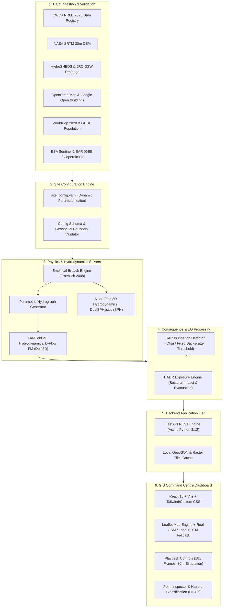

# JalRakshak-HD: System Architecture Specification

## 1. High-Level Architecture

JalRakshak-HD is a modular, configuration-driven dam-break screening and GIS decision-support platform designed for high-resolution hydrodynamic simulation, humanitarian consequence assessment, and satellite-based validation.

> [!IMPORTANT]
> **Solver Coupling Note:** DualSPHysics (3D Lagrangian near-field, $0$–$600\text{ s}$) and D-Flow FM (2D Eulerian far-field, $0$–$30\text{ hr}$) are **decoupled multi-scale solvers** parameterized from the identical dam breach geometry. Direct boundary-flux two-way coupling is not implemented in this prototype.

---

## 2. Component Breakdown

### 2.1 Configuration Layer (`configs/` and `sites/`)
- Encapsulates all site-specific boundaries, dam engineering specifications, CRS projections (e.g., EPSG:32644 for Bhavanisagar/Hirakud), solver grids, and HADR sectors.
- Enables seamless onboarding of new dams without core backend code modifications.

### 2.2 Hydrologic & Hydrodynamic Engine
1. **Breach Engine (`src/breach/`):** Implements Froehlich (2008) empirical dam-break formulations for breach width ($B_{\text{avg}}$), side slopes ($z$), formation time ($t_f$), and peak outflow ($Q_{\text{peak}}$).
2. **D-Flow FM 2D Simulation (`src/dflow/`):** Solves depth-averaged shallow water equations over an $818.37\text{ km}^2$ domain with continuous shock-capturing wetting/drying schemes across $181$ timesteps ($108,000\text{ s}$).
3. **DualSPHysics 3D Simulation (`src/sph/`):** Lagrangian particle hydrodynamics ($10,982$ particles) resolving 3D dam-face overtopping, splash dynamics, and hydrodynamic impact pressures in the initial $600\text{ s}$.

### 2.3 HADR Consequence Module (`src/hadr/`)
- Intersects D-Flow peak flood footprints with **WorldPop** ($100\text{ m}$ ambient) and **GHSL** ($100\text{ m}$ built-up) population grids.
- Computes building damage exposure ($25,652$ mapped structures), road inundation ($243.82\text{ km}$), screened bridge crossings ($20$), and mapped critical facilities ($13$).
- Segregates impacts into 9 distinct municipal response sectors (Sathyamangalam, Gobichettipalayam, Bhavani, etc.) to eliminate double-counting.

### 2.4 Earth Observation & Satellite Module (`src/satellite/`)
- Ingests Copernicus Sentinel-1 Synthetic Aperture Radar (SAR) Ground Range Detected (GRD) backscatter.
- Identifies open water using Otsu automated thresholding and fixed backscatter cutoffs ($\sigma_0 < -16\text{ dB}$).
- Provides historical benchmark validation against documented flooding events.

### 2.5 API & Web GIS Dashboard (`backend/` & `frontend/`)
- **FastAPI Backend:** Serves GeoJSON layers, simulation frame metadata, point depth/velocity time-series, and site configuration schemas.
- **Leaflet GIS Frontend:** High-performance web mapping interface supporting online OpenStreetMap tiles with automatic offline fallback to local NASA SRTM hillshade rasters. Zero manual offsets.
