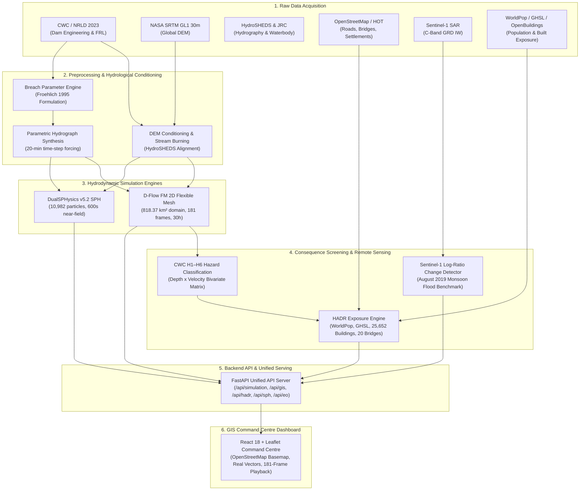

# JalRakshak-HD: End-to-End Scientific Data Lineage (M12)

This document describes the complete, unbroken data lineage from primary scientific and authoritative geospatial data sources to the interactive GIS Command Centre dashboard.

---

## Detailed Component Lineage

### 1. Dam Engineering & Breach Parameterization
* **Source:** Central Water Commission National Register of Large Dams (NRLD) 2023 / Tamil Nadu Water Resources Department records for Bhavanisagar Dam.
* **Processing:** Froehlich (1995/2008) multi-regression empirical formulations computed using reservoir live storage ($V_w = 780.50\text{ MCM}$) and hydraulic head ($H_w = 28.416\text{ m}$).
* **Output:** Average breach width $B_{\text{avg}} = 219.28\text{ m}$, breach formation time $t_f = 14,095.59\text{ s}$ ($3.92\text{ hr}$), peak discharge $Q_{\text{peak}} = 18,742.38\text{ m}^3/\text{s}$.
* **Dashboard Serving:** Displayed in Scenario Summary, Simulation Metadata panel, and Dam Structure popup.

### 2. Terrain & 2D Hydrodynamic Modeling (D-Flow FM)
* **Source:** NASA SRTM 30m Global Elevation Model conditioned with HydroSHEDS river thalweg burning.
* **Processing:** Delft3D Flexible Mesh (D-Flow FM) shallow-water solver running on a 46,830-cell unstructured mesh covering $818.37\text{ km}^2$.
* **Output:** $101.29\text{ km}^2$ maximum inundated area, $22.02\text{ m}$ maximum solver depth, $11.79\text{ m/s}$ maximum velocity across 181 timesteps ($108,000\text{ s} / 30\text{ hr}$).
* **Mass Balance:** Inflow $780.50\text{ MCM} = \text{Outflow } 618.85\text{ MCM} + \text{Stored } 161.69\text{ MCM} + \text{Residual } 0.041\text{ MCM}$ ($0.0052\%$ error, `MASS_CONSERVATION_PASS`).
* **Dashboard Serving:** 181 sequential georeferenced RGBA frames (`frame_000.png` to `frame_180.png`) rendered directly over OpenStreetMap.

### 3. Near-Field SPH Modeling (DualSPHysics)
* **Source:** High-resolution geometric profile derived from dam crest and spillway cross-section.
* **Processing:** DualSPHysics v5.2 Lagrangian particle solver with 10,982 particles ($1.0\text{ m}$ spacing) run for $600\text{ s}$ physical time.
* **Output:** Maximum near-field depth $17.11\text{ m}$, maximum near-field velocity $34.78\text{ m/s}$, front arrival at $1,280.41\text{ m}$ at $600\text{ s}$.
* **Coupling Status:** Independent cross-solver comparative analysis. *Direct coupling is not implemented in production.*

### 4. HADR & Consequence Exposure Analysis
* **Source:** WorldPop 2020 ($100\text{ m}$), GHSL Built-Up Population, Google Open Buildings v3, OpenStreetMap Highway Network.
* **Processing:** Spatial raster zonal statistics and bivariate CWC hazard classification ($H_1$ to $H_6$).
* **Output:** $42,428.1$ WorldPop exposed, $84,500.5$ GHSL exposed, $25,652$ buildings inundated ($22,472$ in $H_5/H_6$), $243.82\text{ km}$ exposed roads, $20$ screened bridge crossings, $13$ critical healthcare facilities partitioned into $6$ non-overlapping response zones.

### 5. Earth Observation Satellite Benchmark
* **Source:** Sentinel-1A C-Band SAR Ground Range Detected (GRD) Interferometric Wide (IW) swath.
* **Processing:** Google Earth Engine log-ratio difference thresholding ($-3.2\text{ dB}$) with Otsu binarization.
* **Output:** $1.1150\text{ km}^2$ historical monsoonal flood vector (August 10, 2019) providing empirical validation of natural low-lying depressions distinct from the hypothetical dam break scenario.
